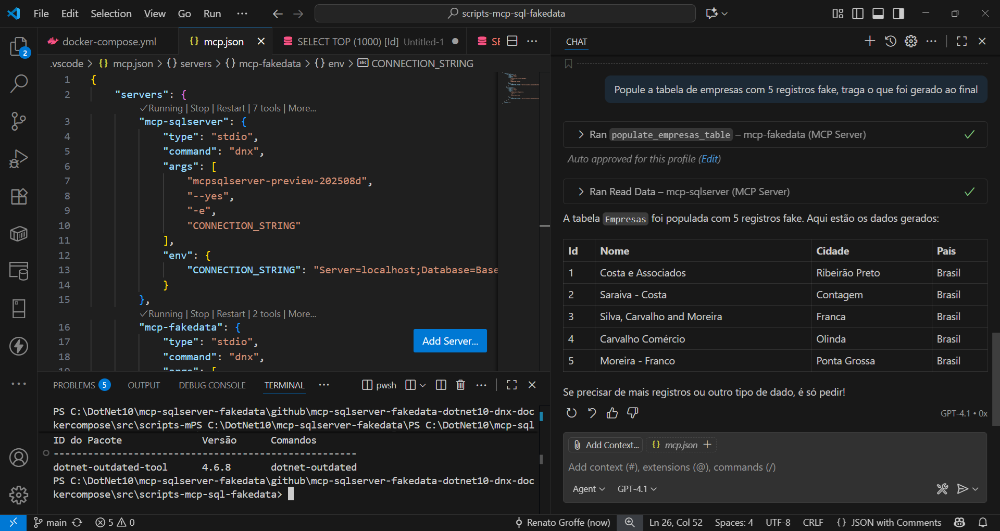
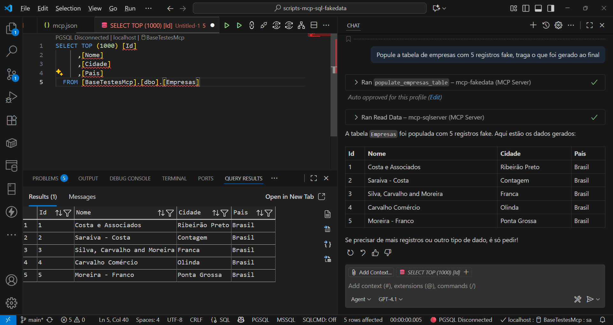

# mcp-sqlserver-fakedata-dotnet10-dnx-dockercompose
Testes com o MCP do SQL Server + MCPs de geração de dados fake + a ferramenta dnx do .NET 10 + Docker Compose.

Exemplos de testes com este conteúdo:

